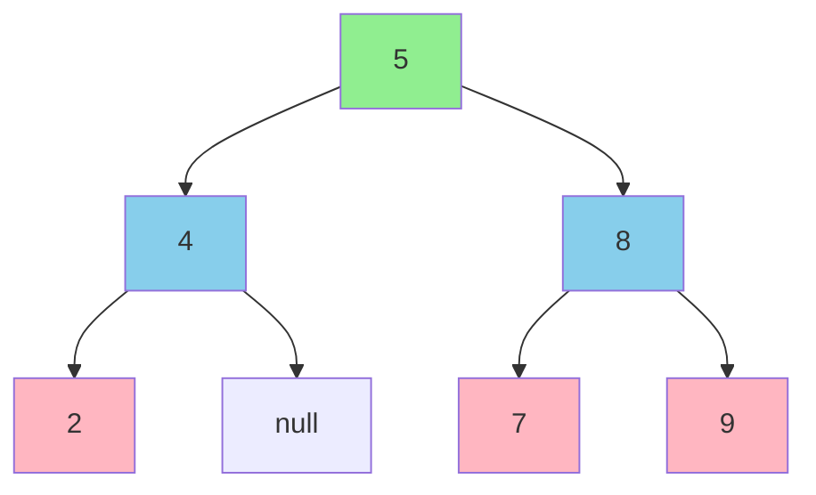
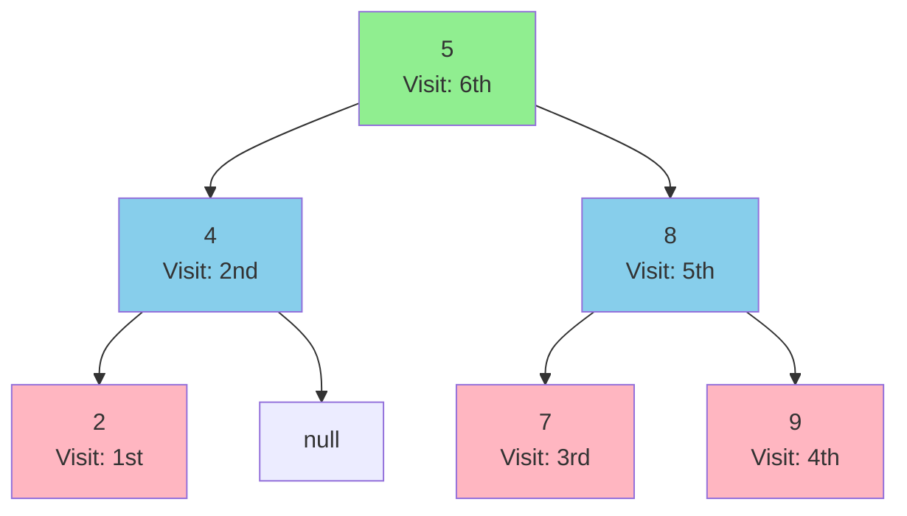

# Tree Nodes in Python

A Python implementation of binary tree traversal algorithms: Inorder, Preorder, and Postorder traversal.

## Tree Structure

This project demonstrates three fundamental tree traversal algorithms using the following binary tree structure:



The tree has:
- **Root**: 5
- **Left subtree**: 4 (with left child 2)
- **Right subtree**: 8 (with left child 7 and right child 9)

## Traversal Algorithms

### 1. Inorder Traversal (Left → Root → Right)

Inorder traversal visits nodes in the following order:
1. Traverse the left subtree
2. Visit the root
3. Traverse the right subtree

**Output**: `2 → 4 → 5 → 7 → 8 → 9`


**Use case**: In a Binary Search Tree (BST), inorder traversal produces values in sorted order.

### 2. Preorder Traversal (Root → Left → Right)

Preorder traversal visits nodes in the following order:
1. Visit the root
2. Traverse the left subtree
3. Traverse the right subtree

**Output**: `5 → 4 → 2 → 8 → 7 → 9`


**Use case**: Useful for creating a copy of the tree or getting prefix expression of an expression tree.

### 3. Postorder Traversal (Left → Right → Root)

Postorder traversal visits nodes in the following order:
1. Traverse the left subtree
2. Traverse the right subtree
3. Visit the root

**Output**: `2 → 4 → 7 → 9 → 8 → 5`



**Use case**: Useful for deleting the tree or getting postfix expression of an expression tree.

## Code Structure

### TreeNode Class

```python
class TreeNode:
    def __init__(self, data):
        self.data = data
        self.leftNode = None
        self.rightNode = None
```

The `TreeNode` class represents a node in the binary tree with:
- `data`: The value stored in the node
- `leftNode`: Reference to the left child
- `rightNode`: Reference to the right child

### Traversal Functions

#### Inorder Traversal
```python
def InorderTraversal(root):
    if root.leftNode != None:
        InorderTraversal(root.leftNode)
    print(root.data)
    if root.rightNode != None:
        InorderTraversal(root.rightNode)
```

#### Preorder Traversal
```python
def PreorderTraversal(root):
    print(root.data)
    if root.leftNode != None:
        PreorderTraversal(root.leftNode)
    if root.rightNode != None:
        PreorderTraversal(root.rightNode)
```

#### Postorder Traversal
```python
def PostorderTraversal(root):
    if root.leftNode != None:
        PostorderTraversal(root.leftNode)
    if root.rightNode != None:
        PostorderTraversal(root.rightNode)
    print(root.data)
```

## Usage

Run the program:

```bash
python c.py
```

This will output:

```
2
4
5
7
8
9
5
4
2
8
7
9
2
4
7
9
8
5
```

The output shows the results of all three traversals in order:
1. **Inorder**: 2, 4, 5, 7, 8, 9
2. **Preorder**: 5, 4, 2, 8, 7, 9
3. **Postorder**: 2, 4, 7, 9, 8, 5

## Comparison of Traversal Algorithms

| Traversal | Order | Output | Common Use Cases |
|-----------|-------|--------|------------------|
| **Inorder** | Left → Root → Right | 2, 4, 5, 7, 8, 9 | Binary Search Trees (sorted output) |
| **Preorder** | Root → Left → Right | 5, 4, 2, 8, 7, 9 | Copy tree, Prefix expressions |
| **Postorder** | Left → Right → Root | 2, 4, 7, 9, 8, 5 | Delete tree, Postfix expressions |

## Time and Space Complexity

All three traversal algorithms have:
- **Time Complexity**: O(n) - where n is the number of nodes (each node is visited exactly once)
- **Space Complexity**: O(h) - where h is the height of the tree (recursion stack space)

## License

This project is open source and available for educational purposes.
