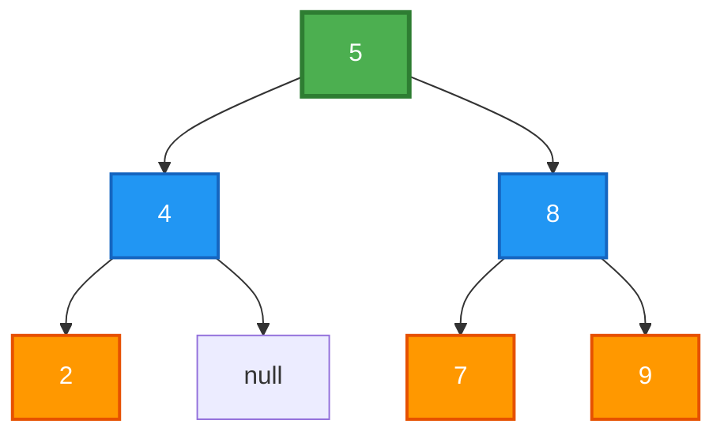
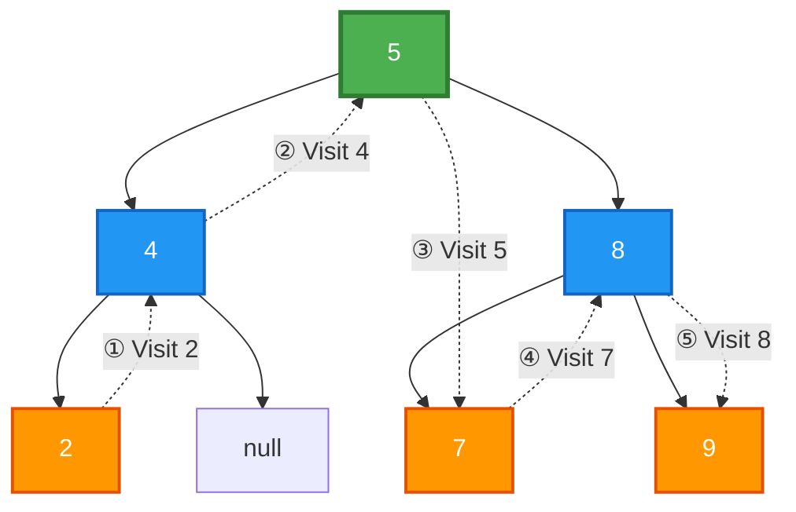
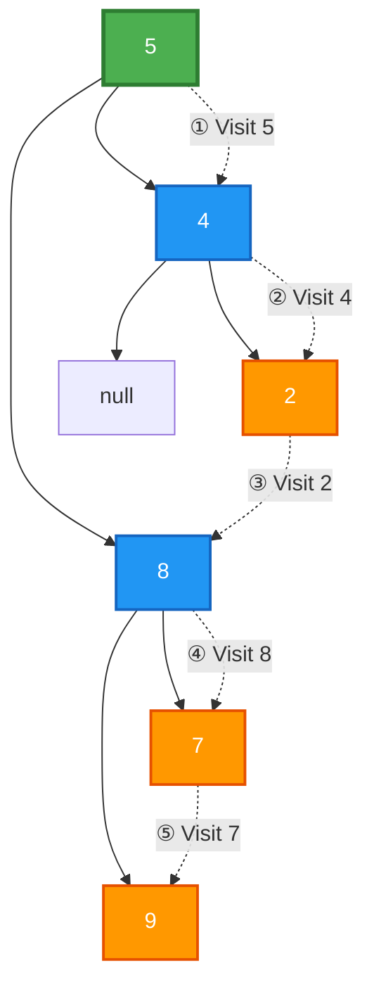
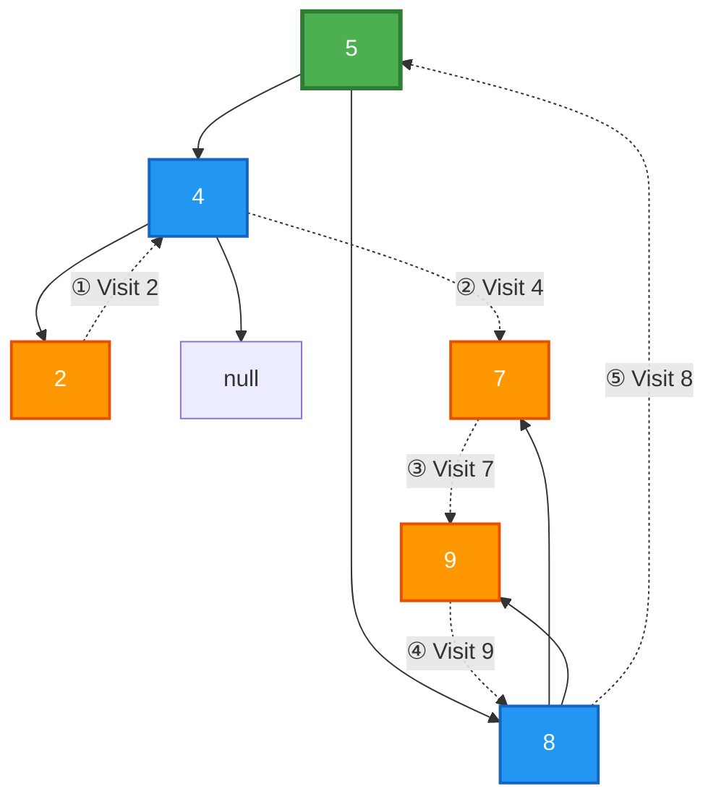

# Tree Nodes in Python

A Python implementation of binary tree data structure with three classic tree traversal algorithms: Inorder, Preorder, and Postorder.

## 📋 Table of Contents
- [Overview](#overview)
- [Tree Structure](#tree-structure)
- [Traversal Algorithms](#traversal-algorithms)
  - [Inorder Traversal](#inorder-traversal)
  - [Preorder Traversal](#preorder-traversal)
  - [Postorder Traversal](#postorder-traversal)
- [Usage](#usage)
- [Installation](#installation)

## Overview

This project demonstrates the implementation of a binary tree and three fundamental tree traversal algorithms. Each traversal visits all nodes in the tree but in a different order, which is useful for various applications such as expression evaluation, tree serialization, and more.

## Tree Structure

The example tree used in this implementation has the following structure:



**Legend:**
- 🟢 **Green (5)**: Root node
- 🔵 **Blue (4, 8)**: Level 1 nodes
- 🟠 **Orange (2, 7, 9)**: Level 2 (leaf) nodes

## Traversal Algorithms

### Inorder Traversal

**Order:** Left → Root → Right

Inorder traversal visits the left subtree first, then the root node, and finally the right subtree. For binary search trees, this produces values in ascending order.



**Traversal sequence:**
```
2 → 4 → 5 → 7 → 8 → 9
```

**Steps:**
1. Visit left subtree (node 2)
2. Visit root of left subtree (node 4)
3. Visit root (node 5)
4. Visit left child of right subtree (node 7)
5. Visit root of right subtree (node 8)
6. Visit right child of right subtree (node 9)

### Preorder Traversal

**Order:** Root → Left → Right

Preorder traversal visits the root node first, then the left subtree, and finally the right subtree. This is useful for creating a copy of the tree or getting prefix expression of an expression tree.



**Traversal sequence:**
```
5 → 4 → 2 → 8 → 7 → 9
```

**Steps:**
1. Visit root (node 5)
2. Visit root of left subtree (node 4)
3. Visit left child of left subtree (node 2)
4. Visit root of right subtree (node 8)
5. Visit left child of right subtree (node 7)
6. Visit right child of right subtree (node 9)

### Postorder Traversal

**Order:** Left → Right → Root

Postorder traversal visits the left subtree first, then the right subtree, and finally the root node. This is useful for deleting the tree or getting postfix expression of an expression tree.



**Traversal sequence:**
```
2 → 4 → 7 → 9 → 8 → 5
```

**Steps:**
1. Visit left child of left subtree (node 2)
2. Visit root of left subtree (node 4)
3. Visit left child of right subtree (node 7)
4. Visit right child of right subtree (node 9)
5. Visit root of right subtree (node 8)
6. Visit root (node 5)

## Usage

Run the program to see all three traversal algorithms in action:

```bash
python c.py
```

**Expected Output:**
```
2
4
5
7
8
9
5
4
2
8
7
9
2
4
7
9
8
5
```

The output shows:
- First 6 lines: Inorder traversal results
- Next 6 lines: Preorder traversal results
- Last 6 lines: Postorder traversal results

### Code Example

```python
from c import TreeNode, InorderTraversal, PreorderTraversal, PostorderTraversal

# Create a binary tree
root = TreeNode(5)
root.leftNode = TreeNode(4)
root.leftNode.leftNode = TreeNode(2)
root.rightNode = TreeNode(8)
root.rightNode.leftNode = TreeNode(7)
root.rightNode.rightNode = TreeNode(9)

# Perform traversals
print("Inorder Traversal:")
InorderTraversal(root)

print("\nPreorder Traversal:")
PreorderTraversal(root)

print("\nPostorder Traversal:")
PostorderTraversal(root)
```

## Installation

1. Clone the repository:
```bash
git clone https://github.com/120m4n/TreeNodesInPython.git
cd TreeNodesInPython
```

2. Run the program (requires Python 3.x):
```bash
python c.py
```

No additional dependencies are required!

## Features

- ✅ Simple and clean implementation
- ✅ Easy to understand tree node structure
- ✅ Three fundamental traversal algorithms
- ✅ Well-commented code
- ✅ No external dependencies

## Algorithm Complexity

| Algorithm | Time Complexity | Space Complexity |
|-----------|----------------|------------------|
| Inorder   | O(n)           | O(h)*            |
| Preorder  | O(n)           | O(h)*            |
| Postorder | O(n)           | O(h)*            |

*Where n is the number of nodes and h is the height of the tree (space complexity is due to recursion call stack)

## License

This project is open source and available for educational purposes.

## Contributing

Feel free to fork this repository and submit pull requests for any improvements!

---

Made with ❤️ for learning tree data structures
